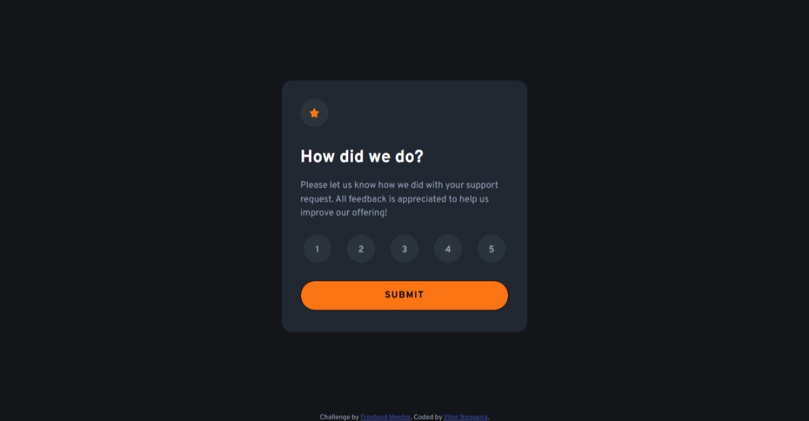

# Frontend Mentor - Interactive rating component solution

This is a solution to the [Interactive rating component challenge on Frontend Mentor](https://www.frontendmentor.io/challenges/interactive-rating-component-koxpeBUmI). Frontend Mentor challenges help you improve your coding skills by building realistic projects. 

## Table of contents

- [Overview](#overview)
  - [The challenge](#the-challenge)
  - [Screenshot](#screenshot)
  - [Links](#links)
- [My process](#my-process)
  - [Built with](#built-with)
  - [What I learned](#what-i-learned)
  - [Continued development](#continued-development)
- [Author](#author)

## Overview

### The challenge

Users should be able to:

- View the optimal layout for the app depending on their device's screen size
- See hover states for all interactive elements on the page
- Select and submit a number rating
- See the "Thank you" card state after submitting a rating

### Screenshot

### Links

- Solution URL: [https://github.com/VitorEmanoelNogueira/interactive-rating-component-main](https://github.com/VitorEmanoelNogueira/interactive-rating-component-main)
- Live Site URL: [https://vitoremanoelnogueira.github.io/interactive-rating-component-main/](https://vitoremanoelnogueira.github.io/interactive-rating-component-main/)

## My process

### Built with

- Semantic HTML5 markup;
- OOCSS, BEM, SMACSS, namespaces;
- CSS custom properties;
- Flexbox;
- Mobile-first workflow.

### What I learned

- Improved knowledge of focus management for keyboard accessibility and form controls;
- Learned practices that help screen readers navigate the page.

### Continued development

- Knowledge in accessibility.

## Author

- Frontend Mentor - [@VitorEmanoelNogueira](https://www.frontendmentor.io/profile/VitorEmanoelNogueira)